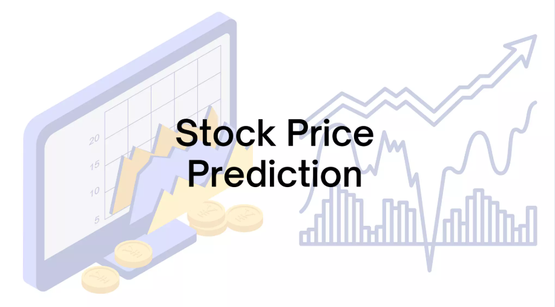

# Google Stock Price Time Series Analysis



## 📌Overview
This project performs a time series analysis on Google's stock price data, retrieved using the yfinance library. The goal is to explore historical stock prices, visualize trends (e.g., closing prices), and potentially apply forecasting models like ARIMA or SARIMAX to predict future prices. The repository demonstrates data retrieval, basic visualization, and sets the stage for advanced time series modeling.

## 📊Dataset

### Description
The dataset consists of historical stock price data for Google (ticker: GOOG), fetched from Yahoo Finance via the yfinance Python library.

- **Source:** Yahoo Finance (GOOG ticker).
- **Time Period:** User-defined range via `start_date` and `end_date` (variables not shown in the snippet; placeholders must be set by the user).
- **Features:**
  - **Open:** Opening price of the stock.
  - **High:** Highest price during the trading day.
  - **Low:** Lowest price during the trading day.
  - **Close:** Closing price of the stock (primary focus for visualization).
  - **Volume:** Trading volume.
  - **Frequency:** Daily data (default for yfinance).

## 🔍Acknowledgements
Data is sourced from Yahoo Finance, a widely-used financial data provider. Ensure compliance with their terms of use when utilizing this data.

## 🛠Methodology

#### Dependencies
The project relies on the following Python libraries:

```python
import pandas as pd
import yfinance as yf
from statsmodels.tsa.seasonal import seasonal_decompose
from statsmodels.tsa.arima.model import ARIMA
from statsmodels.tsa.statespace.sarimax import SARIMAX
from statsmodels.graphics.tsaplots import plot_acf, plot_pacf
import matplotlib.pyplot as plt
import seaborn as sns
```

## 🚀Results
- **Visualization:** A plot of Google’s closing prices is generated, showing the stock’s price trend over the specified period.
- **Modeling:** The snippet does not include model training or forecasting results. Future updates could include ARIMA/SARIMAX predictions and evaluation metrics (e.g., RMSE).

## Future Work
- Implement ARIMA or SARIMAX models for forecasting stock prices.
- Add seasonal decomposition (seasonal_decompose) to analyze trends and seasonality.
- Include evaluation metrics (e.g., RMSE, MAE) for model performance.
- Expand the analysis to multiple stocks or additional features (e.g., technical indicators).
